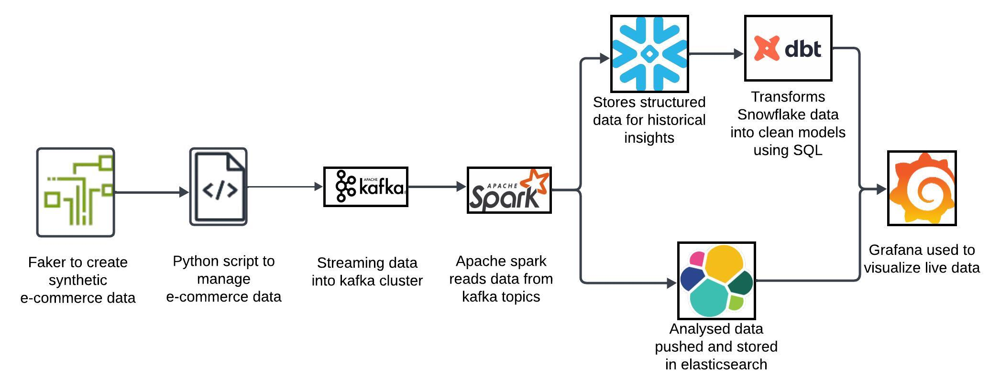
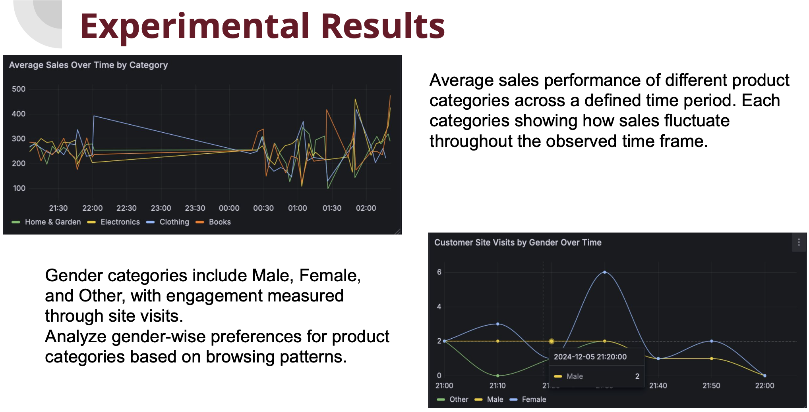
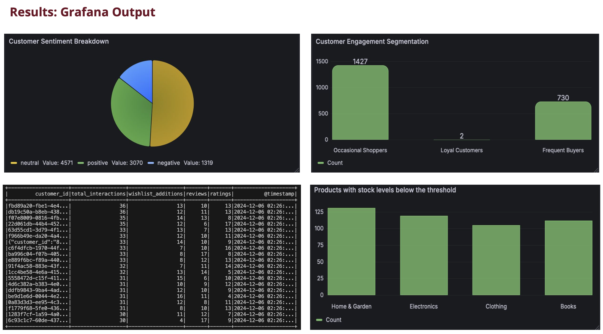
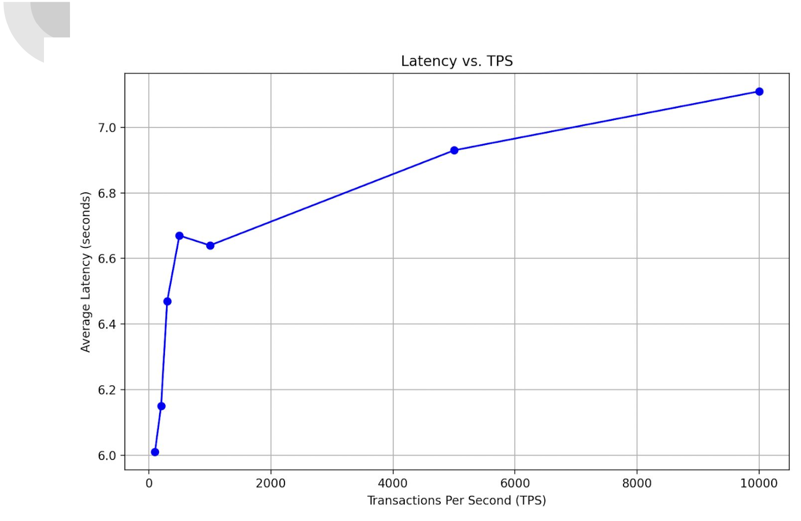

# Real-time-E-commerce-Analytics-System
This repository contains the code for a robust data pipeline integrating Kafka, PySpark, ElasticSearch, and Grafana to achieve real-time analytics for an e-commerce platform

## End to End Latency across different loads (peak sale periods vs low sale periods)

As the load increases and transaction_data, latency rises in a controlled manner, demonstrating the system’s ability to handle higher loads while maintaining predictable performance trends.

